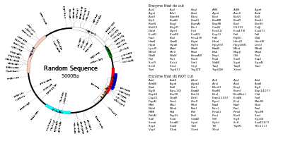

# NucleicAcidViewer
The tool to visualize restriction enzyme site of nucleic acid.
## What is NucleicAcidViewer?
It is a JavaScript-base visualizer of restriction enzyme site. Here is the sample of output image.

## How can I use?
Just open https://tbjustice.github.io/NucleicAcidViewer/ and you can use NucleicAcidViewer!! Or you can clone this project and open "index.html" by browser (Chrome).
## How to use?
1. Create the database of restriction enzymes. Database must be in csv format. Enzyme name is written in the first column, and the target sequence is written in the second column. Columns after third column refers to the sequence which may NOT be cut by the enzyme (because of methylation).
2. Prepare the sequence data in the Genbank format or nav format.
3. Open NucleicAcidViewer and select 2 files. 
4. Click "Start Mapping", then you'll see the result!! 
5. If you open the tab "Region Options", you can edit color, place and shape of the region.  Edit color of region 5   Edit place of region 5  You can edit shape of the region as well.
6. If you open the tab "Enzyme Options", you can edit the visibility of each restriction enzyme site.  For example, HindIII has 4 or more restriction enzyme site, so it is not shown in the result by default.   However, if you click "Outer Bold", the restriction enzyme sites of HindIII will appear.   When you check "Hide Except all" and click one of the 4 choices, sites of Enzymes will be disappear except the one that is now selected. 
7. If you right click the image, you can edit the sequence name, sequence type, and other parameters. 
8. You can save the result in 2 formats. One is "Image(.svg)" and the other is ".nav". "Image(.svg)" contains result image, and ".nav" contains sequence data.
